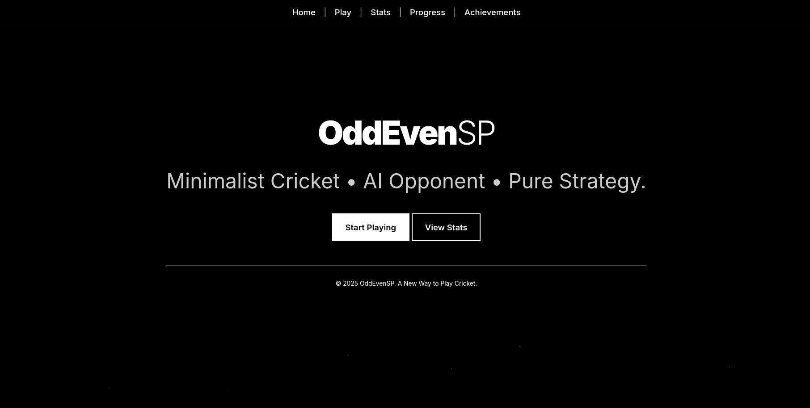

<h1 align="center">OddEven-SP</h1>

  OddEvenSP is a fun, interactive cricket game where you challenge a computer opponent.

  
  
  
  
  

  

---

## Play Online
Experience OddEvenSP directly in your browser:  
**[Play OddEvenSP Online!](https://oddevensp.vercel.app)**  

---

### Web Version
Simply visit the website or run locally and enjoy:
- Click-to-play number selection  
- Interactive coin toss feature  
- Real-time statistics tracking  
- Minimalist design  

---

## Features

### Terminal Version
- Difficulty Levels: Easy, Medium, Hard  
- Dark & Light Terminal Modes  
- Achievements & Stats System  
- Smart AI Opponent  
- Rank & XP Progression System  
- Data Saved Between Sessions  
- Colorful CLI Interface  

### Web Version
- Interactive Click-to-Play Interface  
- Animated Coin Toss Feature  
- Real-time Statistics Dashboard  
- Achievement System with Progress Tracking  
- Visual Rank & Level Progression  
- Minimalist Black & White Design  
- Persistent Game Data  
- Fully Responsive Design  

---

## Player Stats & Achievements

Track your performance across both versions:  
- **Wins, Losses, Ties** – Complete match statistics  
- **High Score & Average** – Personal best tracking  
- **Level & XP System** – Progress through 10 ranks  
- **Achievement Unlocks** – Special milestones:  
  - *First Victory* – Win your first game  
  - *High Scorer* – Score 50+ runs in one game  
  - *Veteran Player* – Play 10 complete games  
  - *On Fire* – Win 5 games in a row  
  - *Champion* – Reach maximum level  

---

## How the Game Works
- Pick a number between 1 and 10.  
- The computer picks one too.  
- If numbers match → You're out!  
- Keep scoring runs, beat the bot, and climb ranks.  

---

## Tip
Choose your mode wisely — terminal theme affects how colors appear.
